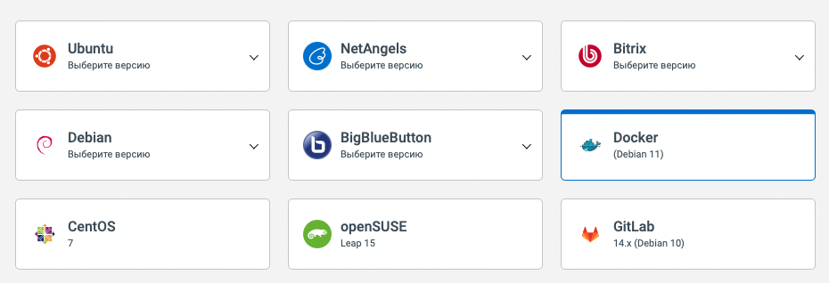

# Deployment

For simplicity, we will deploy the project to VDS. The deployment process consists of several steps:

## 1. Create a VDS on your preferred hosting

Create a VDS virtual machine for Docker, for example, at [NetAngels](https://panel.netangels.ru).

For [secretic.app](https://secretic.app) we used distribution `Docker` (Debian 11):



We will launch the project on [Laravel Sail](https://laravel.com/docs/9.x/sail) - yes, this is not ideal, but for non-production purposes it will do.


## Generate RSA-key (for access to GitHub)

First, generate SSH-keys with `ssh-keygen`:

```bash
cd ~/.ssh && ssh-keygen
```

With default settings, you will see something like:

```bash
Generating public/private rsa key pair.
Enter file in which to save the key (/root/.ssh/id_rsa): 
Enter passphrase (empty for no passphrase): 
Enter same passphrase again: 
Your identification has been saved in /root/.ssh/id_rsa
Your public key has been saved in /root/.ssh/id_rsa.pub
The key fingerprint is:
SHA256:e+Wuo7OK0Vd+oJ3LM75ZAhJq9xZOSZ0schYgsmdFdSg root@vm-80ae16e5
The key's randomart image is:
+---[RSA 3072]----+
|  . ..+oo..      |
|   o oE .= .     |
|  . o o.= +      |
|   o . * o       |
|    o o S o .    |
|   . o = O =     |
|    . . B * +    |
|     o o.o+B     |
|    . ..o=B*.    |
+----[SHA256]-----+
```


## 4. Add RSA-key to GitHub

In the GitHub-repository, in the [Deploy Keys](https://github.com/gomzyakov/secretic/settings/keys) section, set the value of the public key from the virtual machine.

You can get it via:

```bash
cat ~/.ssh/id_rsa.pub
```

This will allow deployment via `git pull` from VDS.

## 4. Set secrets in the repository on GitHub

After that, in the GitHub repository, in the `Settings > Secrets > Actions` section, set the values:

- `SSH_HOST`: This is the IP address of the server.
- `SSH_USERNAME`: This is the server username.
- `SSH_PASSWORD`: This is the user password.


## Clone repository from GitHub

Login to VDS via SSH as `root` user.

Go to path `/usr` and clone current repository (or your own fork). By default, Git clone to `secretic` folder:

```bash
git clone git@github.com:gomzyakov/secretic.git && cd secretic
``````

## 2. Init & run Laravel Sail on VDS

Run the command for the first time:

```bash
docker run --rm \
-u "$(id -u):$(id -g)" \
-v $(pwd):/opt \
-w /opt \
laravelsail/php81-composer:latest \
composer install --ignore-platform-reqs
```

Copy the environment settings:

```bash
cp .env.example .env
```

And replace `DB_HOST` to `mysql` in `.env` (for local development).

Set permissions for some directories:

```bash
chmod -R 777 bootstrap/cache
chmod -R 777 ./storage/logs
chmod -R 777 ./storage/framework
```

Start containers with Sail:

```bash
./vendor/bin/sail up -d
```

After that go to shell:

```bash
./vendor/bin/sail shell
```

And run final commands:

```bash
./artisan key:generate
./artisan migrate:fresh --seed
```

Open VDS IP-address in your favorite browser. Happy using Secretic!


## 5. Optional: Set up HTTPS

>No need if you are using mode `Flexible` on Cloudflare

Read more about HTTPS connection in [HTTPS.md](HTTPS.md)
