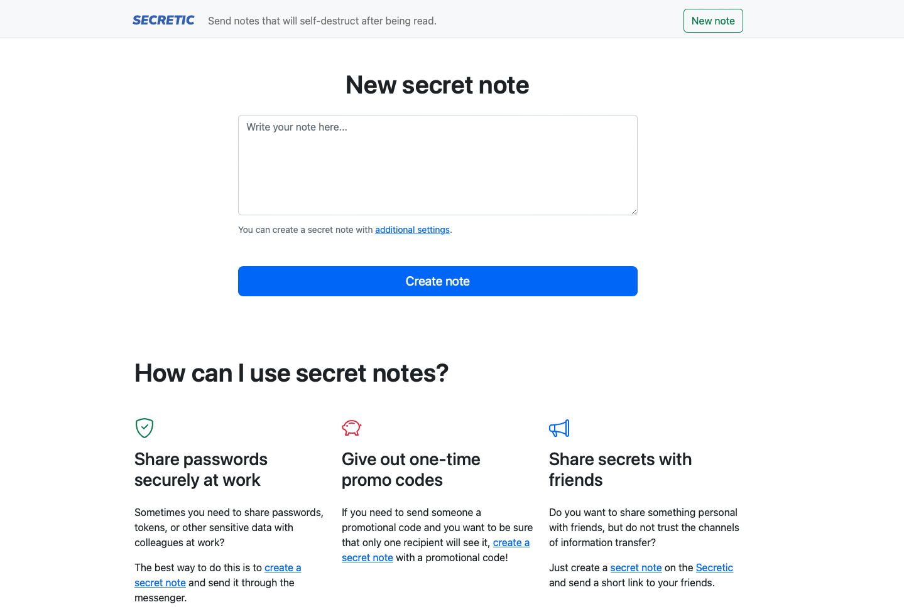

# Secretic

[](https://codecov.io/gh/gomzyakov/secretic)

Create secret notes that will self-destruct after being read. Project demo is on [secretic.app](https://secretic.app). Secretic an open source alternative to [privnote.com](https://privnote.com)



## Running the project locally

When you pull this project to another computer that has no PHP or Composer installed, you cant run `sail` command
because there is no vendor folder.

Solution is https://laravel.com/docs/9.x/sail#installing-composer-dependencies-for-existing-projects

```bash
docker run --rm \
-u "$(id -u):$(id -g)" \
-v $(pwd):/opt \
-w /opt \
laravelsail/php81-composer:latest \
composer install --ignore-platform-reqs
```

Instead of repeatedly typing `vendor/bin/sail` to execute Sail commands, you may wish to configure a Bash alias:

```bash
alias sail='[ -f sail ] && bash sail || bash vendor/bin/sail'
```

Copy the environment settings:

```bash
cp .env.example .env
```

And replace `DB_HOST` to `mysql` in `.env` (for local development).

After that just run the command:

```bash
sail up -d
sail artisan migrate:fresh --seed
```

And open http://127.0.0.1 in your favorite browser. Happy using Secretic! 


## Remove project

To remove all images and volumes, just run:

```bash
sail down --rmi all -v
```

## Deployment to VDS

The deployment process is described in the file [DEPLOY.md](DEPLOY.md)

## Support

If you find any package errors, please, [make an issue](https://github.com/gomzyakov/php-code-style/issues) in current repository.

## License

This is open-sourced software licensed under the [MIT License](https://github.com/gomzyakov/php-code-style/blob/main/LICENSE).
